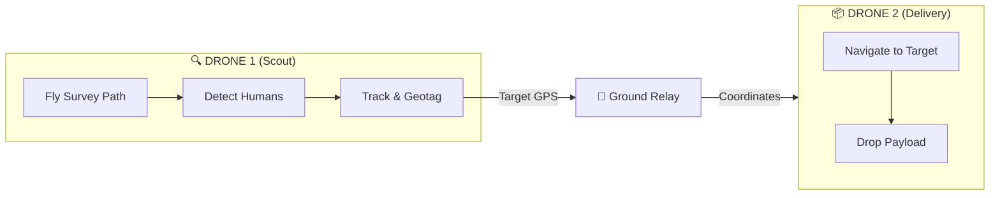

# Nidar - Dual-Drone Search & Rescue System

**Autonomous dual-drone system for human detection and payload delivery.**

> Drone 1 scans an area, detects humans using AI, and sends precise GPS coordinates to Drone 2, which delivers payloads to those locations.

---

## How It Works



**Mission Flow:**
1. **Scout Drone** flies a KML-defined path, scanning for humans
2. **BoT-SORT Tracker** assigns persistent IDs (no double counting)
3. **Geotagging** computes precise target GPS from pixel position
4. **Ground Relay** forwards coordinates to Delivery Drone
5. **Delivery Drone** navigates to each target and drops payload
6. Both drones RTL when complete

---

## Quick Start

### 1. Install

```bash
# Clone & setup
git clone https://github.com/your-repo/Nidar--2025-ELKA-.git
cd Nidar--2025-ELKA-

# Using conda (recommended)
conda create -n Nidar python=3.10
conda activate Nidar
pip install -r requirements.txt
```

### 2. Configure

Edit `config/network_map.yaml`:
```yaml
ground_relay:
  ip: "192.168.1.100"    # Your laptop IP
  zmq_port: 5555

drone1:
  mavlink_connection: "udp:127.0.0.1:14550"
  
drone2:
  mavlink_connection: "udp:127.0.0.1:14551"
```

Edit `config/mission_params.yaml`:
```yaml
detection:
  model_path: "best_model/dj_yolo_best/weights/best.pt"
  confidence_threshold: 0.70

camera:
  rtsp_url: "rtsp://192.168.144.25:8554/main.264"
```

### 3. Test (Before Flying!)

```bash
# Test tracker on video
python tests/test_human_tracker.py --video /path/to/video.mp4

# Test live camera (no drone)
python tests/test_live_detection.py --track --no-mavlink

# Test mission in dry-run mode
python missions/01_survey_leader.py --test
```

### 4. Run Full Mission

Open 3 terminals:

```bash
# Terminal 1: Ground Relay
python missions/00_ground_relay.py

# Terminal 2: Delivery Drone (start first, waits for targets)
python missions/02_delivery_follower.py

# Terminal 3: Survey Drone
python missions/01_survey_leader.py --kml config/geofence/sector_alpha.kml
```

---

## Project Structure

```
Nidar--2025-ELKA-/
├── config/
│   ├── mission_params.yaml    # Flight, detection, tracking settings
│   ├── network_map.yaml       # Network IPs and ports
│   └── geofence/              # KML survey areas
│
├── src/
│   ├── base/                  # Hardware drivers
│   │   ├── drone_pilot.py     # MAVLink flight control
│   │   └── payload_servo.py   # Drop mechanism
│   │
│   ├── intelligence/          # AI & Decision Making
│   │   ├── human_tracker.py   # BoT-SORT tracking + counting
│   │   ├── geotagging.py      # Pixel → GPS conversion
│   │   └── path_finder.py     # KML → waypoints
│   │
│   ├── comms/                 # Networking
│   │   ├── bridge_client.py   # Drone ZMQ client
│   │   └── relay_server.py    # Ground station
│   │
│   └── utils/                 # Helpers
│
├── missions/                  # Main executables
│   ├── 00_ground_relay.py     # Laptop relay server
│   ├── 01_survey_leader.py    # Scout drone mission
│   └── 02_delivery_follower.py# Delivery drone mission
│
└── tests/                     # Test scripts
    ├── test_human_tracker.py  # Test tracker on video
    └── test_live_detection.py # Test with camera
```

---

## Key Features

### 🎯 BoT-SORT Human Tracking
- Persistent track IDs across frames
- Camera motion compensation (for drone movement)
- Re-ID appearance matching
- Counts each person only once

### 🌍 Precision Geotagging
- Converts pixel position → GPS coordinates
- Accounts for drone heading (rotation)
- GSD-based calculation for altitude accuracy

### 🔗 ZMQ Communication
- Reliable message delivery with ACKs
- Real-time coordinate forwarding
- Battery/status monitoring

### 🛡️ Safety Features
- Battery failsafe (auto-RTL at 20%)
- Payload exhaustion detection
- Connection loss handling
- FIFO target queue (no race conditions)

---

## Configuration Reference

### Tracking (`mission_params.yaml`)

```yaml
tracking:
  enabled: true
  track_buffer: 90           # Frames to keep lost tracks
  new_track_thresh: 0.7      # Higher = fewer false tracks
  with_reid: true            # Appearance-based matching
  counting_box_ratio: 0.9    # Detection zone size
```

### Camera Geotagging

```yaml
camera:
  sensor_width_mm: 7.6       # Camera sensor size
  focal_length_mm: 4.4       # Lens focal length
  gimbal_pitch_deg: 90       # 90 = nadir (straight down)
```

---

## Troubleshooting

| Problem | Solution |
|---------|----------|
| No detections | Lower `confidence_threshold` to 0.4-0.5 |
| Duplicate counts | Increase `new_track_thresh` to 0.8 |
| Wrong target GPS | Check `gimbal_pitch_deg` and heading |
| RTSP timeout | Verify camera IP, try `ffplay rtsp://...` |
| ZMQ connection failed | Check firewall, verify IPs match |

---

## Requirements

- Python 3.9+
- NVIDIA GPU + CUDA (recommended)
- ArduPilot/PX4 flight controller
- SIYI or similar RTSP camera
- Local WiFi network

---

## License

MIT License - See [LICENSE](LICENSE) for details.

> ⚠️ **Always test in simulation (SITL) before real flights. Follow local drone regulations.**
