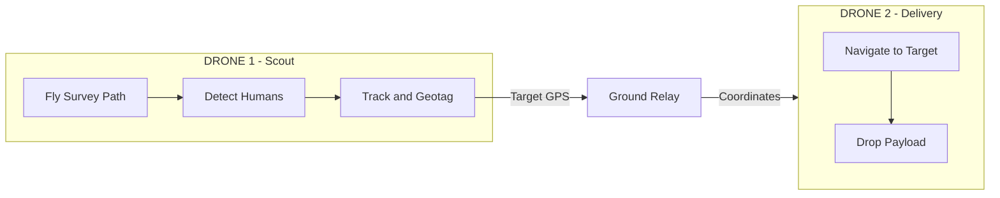

# Nidar - Dual-Drone Search and Rescue System

Autonomous dual-drone system for human detection and payload delivery.

Drone 1 scans an area, detects humans using AI, and sends precise GPS coordinates to Drone 2, which delivers payloads to those locations.

---

## System Architecture



**Mission Flow:**
1. Scout Drone flies a KML-defined path, scanning for humans
2. BoT-SORT Tracker assigns persistent IDs (no double counting)
3. Geotagging computes precise target GPS from pixel position
4. Ground Relay forwards coordinates to Delivery Drone
5. Delivery Drone navigates to each target and drops payload
6. Both drones RTL when complete

---

## Quick Start

### 1. Install

```bash
git clone https://github.com/your-repo/Nidar--2025-ELKA-.git
cd Nidar--2025-ELKA-

# Using conda (recommended)
conda create -n Nidar python=3.10
conda activate Nidar
pip install -r requirements.txt
```

### 2. Configure

Edit `config/network_map.yaml`:
```yaml
ground_relay:
  ip: "192.168.1.100"    # Your laptop IP
  zmq_port: 5555

drone1:
  mavlink_connection: "udp:127.0.0.1:14550"
  
drone2:
  mavlink_connection: "udp:127.0.0.1:14551"
```

Edit `config/mission_params.yaml`:
```yaml
detection:
  model_path: "best_model/dj_yolo_best/weights/best.pt"
  confidence_threshold: 0.70

camera:
  rtsp_url: "rtsp://192.168.144.25:8554/main.264"

payload:
  use_esp32: true
  esp32_serial_port: "/dev/ttyUSB0"
```

### 3. Test Before Flying

```bash
# Test tracker on video
python tests/test_human_tracker.py --video /path/to/video.mp4

# Test live camera (no drone)
python tests/test_live_detection.py --track --no-mavlink

# Test ESP32 payload mechanism
python -c "from src.base.payload_esp32 import PayloadESP32; p = PayloadESP32(); p.test_servo()"

# Test mission in dry-run mode
python missions/01_survey_leader.py --test
```

### 4. Run Full Mission

Open 3 terminals:

```bash
# Terminal 1: Ground Relay
python missions/00_ground_relay.py

# Terminal 2: Delivery Drone (start first, waits for targets)
python missions/02_delivery_follower.py

# Terminal 3: Survey Drone
python missions/01_survey_leader.py --kml config/geofence/sector_alpha.kml
```

---

## Project Structure

```
Nidar--2025-ELKA-/
├── config/
│   ├── mission_params.yaml    # Flight, detection, tracking, payload settings
│   ├── network_map.yaml       # Network IPs and ports
│   └── geofence/              # KML survey areas
│
├── src/
│   ├── base/                  # Hardware drivers
│   │   ├── drone_pilot.py     # MAVLink flight control
│   │   ├── payload_servo.py   # MAVLink servo control
│   │   └── payload_esp32.py   # ESP32 + PCA9685 servo control
│   │
│   ├── intelligence/          # AI and Decision Making
│   │   ├── human_tracker.py   # BoT-SORT tracking + counting
│   │   ├── human_detector.py  # YOLO detection only
│   │   ├── geotagging.py      # Pixel to GPS conversion
│   │   └── path_finder.py     # KML to waypoints
│   │
│   ├── comms/                 # Networking
│   │   ├── bridge_client.py   # Drone ZMQ client
│   │   └── relay_server.py    # Ground station server
│   │
│   └── utils/                 # Helpers
│       ├── geo_math.py        # Geospatial calculations
│       └── state_machine.py   # Mission state tracking
│
├── missions/                  # Main executables
│   ├── 00_ground_relay.py     # Laptop relay server
│   ├── 01_survey_leader.py    # Scout drone mission
│   └── 02_delivery_follower.py# Delivery drone mission
│
├── firmware/                  # Microcontroller code
│   └── esp32_payload/         # ESP32 payload drop controller
│       └── esp32_payload.ino  # Arduino firmware
│
├── simulation/                # Testing and simulation
│   ├── sitl_launcher.py       # ArduPilot SITL launcher
│   ├── mock_components.py     # Mock drone, payload, camera
│   └── test_dual_mission.py   # Full mission simulation
│
└── tests/                     # Test scripts
    ├── test_human_tracker.py  # Test tracker on video
    ├── test_live_detection.py # Test with camera
    └── test_geotagging.py     # Geotagging unit tests
```

---

## Simulation and Testing

### Mock Simulation (No Hardware)

Run a complete mission simulation without any hardware:

```bash
python simulation/test_dual_mission.py --detections 5
```

This simulates:
- Drone 1 flying waypoints and detecting humans
- Geotagging computing target GPS
- Drone 2 receiving coordinates and dropping payloads

### ArduPilot SITL (Full Flight Simulation)

Run a complete dual-drone simulation using ArduPilot's Software-In-The-Loop (SITL).

#### Prerequisites

1. **Install ArduPilot**
   ```bash
   cd ~
   git clone --recurse-submodules https://github.com/ArduPilot/ardupilot.git
   cd ardupilot
   
   # Install dependencies
   Tools/environment_install/install-prereqs-ubuntu.sh -y
   
   # Reload environment
   . ~/.profile
   
   # Build ArduCopter SITL
   ./waf configure --board sitl
   ./waf copter
   ```

2. **Set Environment Variable**
   ```bash
   echo 'export ARDUPILOT_HOME=~/ardupilot' >> ~/.bashrc
   source ~/.bashrc
   ```

3. **Install Python Dependencies**
   ```bash
   pip install pymavlink pexpect empy
   ```

4. **(Optional) Install QGroundControl**
   ```bash
   # Download AppImage
   wget https://d176tv9ibo4jno.cloudfront.net/latest/QGroundControl.AppImage
   chmod +x QGroundControl.AppImage
   ./QGroundControl.AppImage
   ```

#### Network Configuration (Dual Drone)

| Drone | UDP Address | System ID |
|-------|-------------|-----------|
| Drone 1 | `127.0.0.1:14550` | 1 |
| Drone 2 | `127.0.0.1:14560` | 2 |

#### Running the Simulation

**Terminal 1: Start SITL with 2 Drones**
```bash
cd ~/ardupilot/ArduCopter
sim_vehicle.py --count=2 -w
```

Wait for both drones to initialize. You'll see:
```
APM: ArduCopter V4.x.x
APM: Frame: QUAD
```

**Terminal 2: Run the Dual Drone Controller**
```bash
cd /path/to/Nidar--2025-ELKA-
conda activate Nidar
python simulation/dual_drone_controller.py
```

#### Expected Output

```
============================================================
Dual Drone Controller - ArduPilot SITL
============================================================

Starting concurrent drone missions...
------------------------------------------------------------
[ID:1] Connecting to udpin:127.0.0.1:14550...
[ID:2] Connecting to udpin:127.0.0.1:14560...
[ID:1] Heartbeat received! (System: 1, Component: 1)
[ID:2] Heartbeat received! (System: 2, Component: 1)
[ID:1] Setting mode to GUIDED...
[ID:2] Setting mode to GUIDED...
[ID:1] Mode changed to GUIDED
[ID:2] Mode changed to GUIDED
[ID:1] Arming...
[ID:2] Arming...
[ID:1] Armed successfully!
[ID:2] Armed successfully!
[ID:1] Taking off to 10m...
[ID:2] Taking off to 10m...
[ID:1] Moving North to x=10...
[ID:2] Moving South to x=-10...
...
[ID:1] Landed
[ID:2] Landed
------------------------------------------------------------
All drone missions completed!
============================================================
```

#### Visualize in QGroundControl

1. Launch QGroundControl
2. Go to **Application Settings > Comm Links**
3. Add two UDP connections:
   - Connection 1: `127.0.0.1:14550`
   - Connection 2: `127.0.0.1:14560`
4. Both drones will appear on the map

#### Mission Sequence

1. **Connect** - Wait for heartbeat from each drone
2. **GUIDED Mode** - Switch to GUIDED for autonomous control
3. **Arm** - Arm motors (with force flag for SITL)
4. **Takeoff** - Climb to 10 meters
5. **Move** - Drone 1 flies North (x=10m), Drone 2 flies South (x=-10m)
6. **Return** - Both return to origin
7. **Land** - Switch to LAND mode

#### Troubleshooting SITL

| Issue | Solution |
|-------|----------|
| `sim_vehicle.py: command not found` | Source `~/.profile` or add ArduPilot to PATH |
| `No heartbeat received` | Check UDP port, ensure SITL is running |
| `Mode change not confirmed` | Wait for SITL to fully initialize (GPS lock) |
| Arm fails | Use `-w` flag to wipe EEPROM on first run |
| Connection refused | Verify no other process is using the UDP port |

---

## Key Features

### BoT-SORT Human Tracking
- Persistent track IDs across frames
- Camera motion compensation for drone movement
- Re-ID appearance matching
- Counts each person only once

### Precision Geotagging
- Converts pixel position to GPS coordinates
- Accounts for drone heading rotation
- GSD-based calculation for altitude accuracy

### ZMQ Communication
- Reliable message delivery with acknowledgments
- Real-time coordinate forwarding
- Battery and status monitoring

### ESP32 Payload Control
- PCA9685 16-channel PWM driver
- Serial command interface (DROP, HOLD, TEST)
- Independent of flight controller

### Safety Features
- Battery failsafe (auto-RTL at 20%)
- Payload exhaustion detection
- Connection loss handling
- FIFO target queue (no race conditions)

---

## Configuration Reference

### Tracking

```yaml
tracking:
  enabled: true
  track_buffer: 90           # Frames to keep lost tracks
  new_track_thresh: 0.7      # Higher = fewer false tracks
  with_reid: true            # Appearance-based matching
  counting_box_ratio: 0.9    # Detection zone size
```

### Camera Geotagging

```yaml
camera:
  sensor_width_mm: 7.6       # Camera sensor size
  focal_length_mm: 4.4       # Lens focal length
  gimbal_pitch_deg: 90       # 90 = nadir (straight down)
```

### Payload (ESP32)

```yaml
payload:
  use_esp32: true
  esp32_serial_port: "/dev/ttyUSB0"
  esp32_baud_rate: 115200
  initial_count: 10
  drop_altitude: 10.0
```

---

## Hardware Setup

### ESP32 Payload Controller

```
ESP32 (I2C)        PCA9685           Servo
  SDA (21) ------> SDA    CH0 -----> Signal
  SCL (22) ------> SCL               GND
  3.3V ----------> VCC               V+
  GND -----------> GND
```

**Firmware Upload:**
1. Install Arduino IDE with ESP32 board support
2. Install Adafruit PWM Servo Driver Library
3. Open `firmware/esp32_payload/esp32_payload.ino`
4. Upload to ESP32

---

## Troubleshooting

| Problem | Solution |
|---------|----------|
| No detections | Lower confidence_threshold to 0.4-0.5 |
| Duplicate counts | Increase new_track_thresh to 0.8 |
| Wrong target GPS | Check gimbal_pitch_deg and heading |
| RTSP timeout | Verify camera IP, try ffplay rtsp://... |
| ZMQ connection failed | Check firewall, verify IPs match |
| ESP32 not responding | Check serial port, verify baud rate |

---

## Requirements

- Python 3.9+
- NVIDIA GPU + CUDA (recommended)
- ArduPilot/PX4 flight controller
- SIYI or similar RTSP camera
- ESP32 + PCA9685 for payload control
- Local WiFi network

---

## License

MIT License - See LICENSE file for details.

**Always test in simulation (SITL) before real flights. Follow local drone regulations.**
