# Nidar - Dual-Drone Mission Control System

A locally-networked system for coordinating two drones: one surveys an area using YOLO-based human detection, while the other delivers payloads to detected locations.

---

## System Overview

```mermaid
flowchart TB
    subgraph DRONE1["🛸 DRONE 1: SURVEYOR"]
        D1A["📍 KML Path Planning"]
        D1B["🔍 YOLO Detection"]
        D1C["📡 GPS Geotagging"]
    end
    
    subgraph RELAY["💻 GROUND RELAY"]
        R1["📨 Message Router"]
        R2["📊 Status Monitor"]
        R3["📝 Logging"]
    end
    
    subgraph DRONE2["🛸 DRONE 2: DELIVERER"]
        D2A["📥 Target Queue"]
        D2B["🎯 Navigation"]
        D2C["📦 Payload Drop"]
    end
    
    DRONE1 <-->|"ZMQ\nTCP/5555"| RELAY
    RELAY <-->|"ZMQ\nTCP/5555"| DRONE2
    
    D1C -->|"GPS Coordinates"| R1
    R1 -->|"Target Location"| D2A
```



---

## Project Structure

```
Nidar--2025-ELKA-/
├── config/                     # Configuration files
│   ├── mission_params.yaml     # Flight, detection, payload settings
│   ├── network_map.yaml        # Network IPs and ports
│   └── geofence/
│       └── sector_alpha.kml    # Survey area definition
│
├── src/                        # Source code
│   ├── base/                   # Hardware abstraction
│   │   ├── drone_pilot.py      # MAVLink flight control
│   │   └── payload_servo.py    # Drop mechanism driver
│   │
│   ├── intelligence/           # Decision making
│   │   ├── path_finder.py      # KML to waypoints conversion
│   │   ├── human_detector.py   # YOLO detection
│   │   └── geotagging.py       # GSD-based GPS coordinate calculation
│   │
│   ├── comms/                  # Networking
│   │   ├── bridge_client.py    # Drone ZMQ client
│   │   ├── relay_server.py     # Ground station server
│   │   └── telemetry_forwarder.py # MAVLink GCS forwarding
│   │
│   └── utils/                  # Helpers
│       ├── geo_math.py         # Geospatial calculations
│       └── state_machine.py    # Mission state tracking
│
├── missions/                   # Executables
│   ├── 00_ground_relay.py      # Laptop relay server
│   ├── 01_survey_leader.py     # Drone 1 mission
│   └── 02_delivery_follower.py # Drone 2 mission
│
├── tests/                      # Test suite
│   ├── test_live_detection.py  # Live camera detection test
│   ├── test_geotagging.py      # Geotagging unit tests
│   └── ...                     # Other tests
├── logs/                       # Auto-generated logs
└── requirements.txt            # Dependencies
```

---

## Installation

### Prerequisites

- Python 3.9+
- NVIDIA GPU with CUDA (recommended for YOLO)
- MAVLink-compatible flight controllers (ArduPilot/PX4)
- Local WiFi network

### Setup

```bash
# Create virtual environment
python -m venv venv
source venv/bin/activate

# Install dependencies
pip install -r requirements.txt
```

---

## Configuration

### 1. Network Setup

Edit `config/network_map.yaml` with your local network IPs:

```yaml
ground_relay:
  ip: "192.168.1.100"    # Laptop IP
  zmq_port: 5555

drone1:
  mavlink_connection: "udp:127.0.0.1:14550"
  zmq_identity: "SURVEYOR"

drone2:
  mavlink_connection: "udp:127.0.0.1:14551"
  zmq_identity: "DELIVERER"
```

### 2. Mission Parameters

Edit `config/mission_params.yaml`:

```yaml
flight:
  survey:
    cruise_altitude: 20.0    # Survey height (meters)
  delivery:
    hold_altitude: 25.0      # Loiter height
    
detection:
  model_path: "/path/to/weights/best.pt"
  confidence_threshold: 0.70
  
payload:
  initial_count: 10          # Payloads loaded
  drop_altitude: 10.0        # Drop height
```

### 3. Camera & Geotagging

Configure camera calibration for accurate GPS coordinate calculation:

```yaml
camera:
  rtsp_url: "rtsp://192.168.144.25:8554/main.264"
  frame_width: 1920
  frame_height: 1080
  # Geotagging calibration
  sensor_width_mm: 7.6      # Camera sensor width
  focal_length_mm: 4.4      # Camera focal length
  gimbal_pitch_deg: 90      # 90 = straight down (nadir)
```

### 4. Survey Area

Define the survey polygon in `config/geofence/sector_alpha.kml` (can be created with Google Earth).

### 4. GCS Monitoring (Mission Planner)

To monitor missions in Mission Planner, configure telemetry forwarding in `config/network_map.yaml`:

```yaml
gcs:
  enabled: true                  # Enable telemetry forwarding
  ip: "192.168.1.100"            # IP where Mission Planner is running
  drone1_port: 14560             # UDP port for Drone 1 telemetry
  drone2_port: 14561             # UDP port for Drone 2 telemetry
```

**Mission Planner Setup:**

1. Open Mission Planner
2. Go to **Connection** dropdown
3. Select **UDP**
4. Set port to **14560** (for Drone 1) or **14561** (for Drone 2)
5. Click **Connect**

You can open multiple Mission Planner instances to monitor both drones simultaneously.

---

## Quick Start Guide

### Step 1: Install Dependencies

```bash
cd /path/to/Nidar--2025-ELKA-
python -m venv venv
source venv/bin/activate
pip install -r requirements.txt
```

### Step 2: Configure Network

Edit `config/network_map.yaml` with your network IPs.

### Step 3: Test Detection (Recommended First)

```bash
# Test live detection with camera (no drone needed)
python tests/test_live_detection.py --no-mavlink

# Test with drone connection
python tests/test_live_detection.py
```

Press `q` to quit, `s` to save frame, `t` to toggle tracking.

### Step 4: Run Unit Tests

```bash
# Test geotagging calculations
python tests/test_geotagging.py

# Run all tests
python -m pytest tests/ -v
```

---

## Mission Execution

### Test Mode (No Flight)

```bash
# Test survey mission
python missions/01_survey_leader.py --test

# Test delivery mission
python missions/02_delivery_follower.py --test
```

### Full Mission

**Terminal 1 - Ground Relay:**
```bash
python missions/00_ground_relay.py
```

**Terminal 2 - Delivery Drone:**
```bash
python missions/02_delivery_follower.py
```

**Terminal 3 - Survey Drone:**
```bash
python missions/01_survey_leader.py --kml config/geofence/sector_alpha.kml
```

---

## Running Tests

```bash
# Run all tests
python -m pytest tests/ -v

# Run specific test
python -m pytest tests/test_kml_parsing.py -v

# Run with coverage
python -m pytest tests/ --cov=src --cov-report=html
```

---

## Safety Features

### Battery Failsafe
- Continuous battery monitoring
- Automatic RTL below 20% or 14V

### Payload Exhaustion
- Strict count tracking
- Immediate RTL when payload count reaches 0

### Race Condition Handling
- FIFO queue for targets
- Completes current drop before processing next

### Connection Loss
- Heartbeat monitoring (1s interval, 5s timeout)
- Auto-reconnect attempts
- Buffered messages

---

## Network Architecture

The system uses ZeroMQ for local communication:


- **ZMQ ROUTER/DEALER** - Async bidirectional communication
- **Coordinate ACKs** - Messages require acknowledgment

---

## Geotagging

The geotagging module converts detected object positions to GPS coordinates:

```python
from src.intelligence.geotagging import GeoTagger

# Initialize with camera config
geotagger = GeoTagger(camera_config)

# Compute target GPS from detection
result = geotagger.geotag_detection(
    box_xywh=[960, 540, 100, 200],  # Detection center & size
    confidence=0.9,
    drone_lat=12.97, drone_lon=77.59, drone_alt=20.0,
    drone_heading=45.0  # Heading compensation
)

print(f"Target: ({result.target_lat:.6f}, {result.target_lon:.6f})")
print(f"GSD: {result.gsd_m:.4f} m/px")
```

**Key features:**
- GSD (Ground Sample Distance) calculation
- Drone heading compensation for accurate N/E mapping
- WGS84-aware coordinate conversion

---

## YOLO Model

Default model path:
```
best_model/dj_yolo_best/weights/best.pt
```

Detection parameters:
- Confidence threshold: 70%
- Target class: Person (ID 0)
- Frame skip: Process every 2nd frame

---

## Logs

```
logs/
├── flight_logs/          # MAVLink telemetry
├── detections/           # Detection snapshots with bounding boxes
└── relay_*.log           # Message relay logs
```

---

## Troubleshooting

| Issue | Solution |
|-------|----------|
| No GPS Fix | Ensure GPS has clear sky view, wait 30-60s for 3D fix |
| MAVLink Connection Failed | Check connection string in `network_map.yaml`, verify port forwarding |
| YOLO Detection Not Working | Verify model path exists, check RTSP stream URL, ensure GPU available |
| ZMQ Connection Issues | Verify devices on same network, check firewall (port 5555) |

---

## License

MIT License - See LICENSE file for details.

---

**IMPORTANT**: Always test in simulation first. Ensure compliance with local drone regulations.
